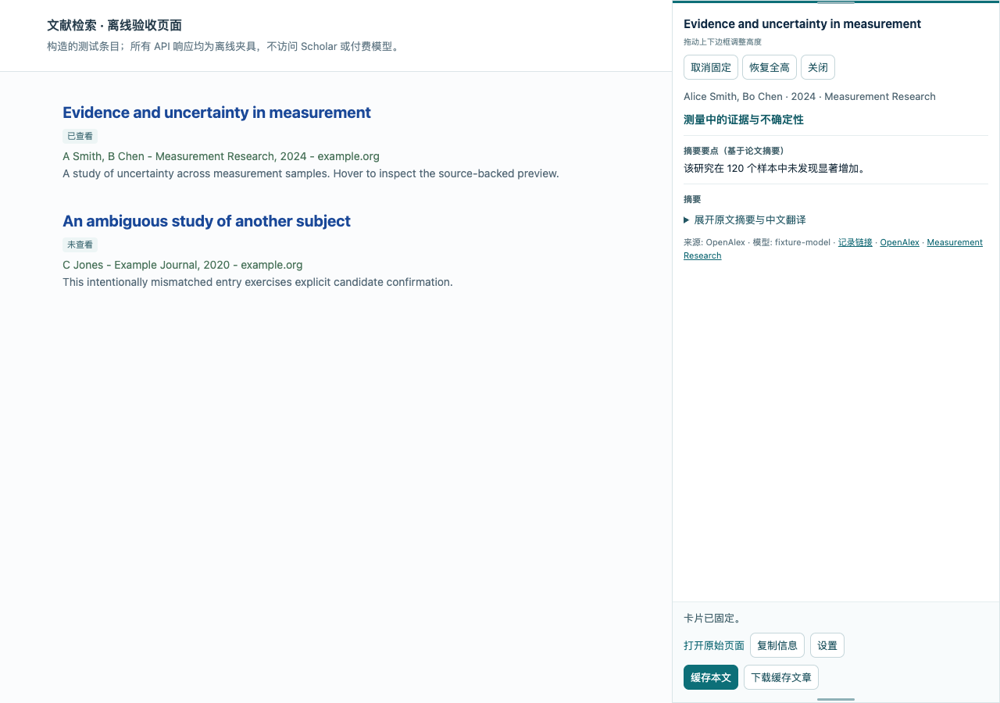
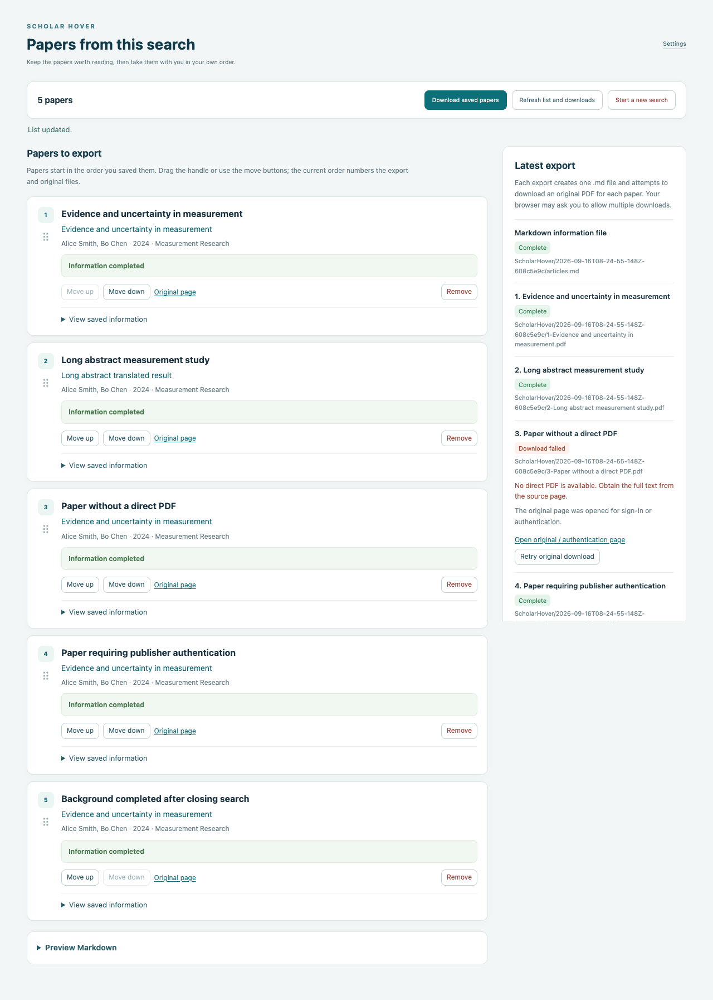

# Scholar Hover · 知阅

**不用逐篇打开，也能决定下一篇读什么。**

一个桌面 Chrome 插件，把有来源的论文预览放在 Google Scholar 搜索结果旁。翻译标题和摘要、保留已经生成的信息；确定要读时立即保存，让后台继续补全。

[English](README.md) · **简体中文**

[下载 v0.4.0](https://github.com/Jerrywjr/scholar-hover/releases/tag/v0.4.0) · [详细配置说明](scholar-hover/README.zh-CN.md) · [反馈问题](https://github.com/Jerrywjr/scholar-hover/issues) · [MIT 开源许可](LICENSE)

## 要解决的问题：筛选文献总在打断检索

搜到一个看起来相关的标题，接下来通常是打开新标签页、寻找摘要、翻译、把有用的信息复制到别处。翻过几篇后，又回到刚才的结果，重复这些操作。而已经确定想保留的文章，如果还得等模型生成完才能保存，又多了一次等待。

知阅把这一步筛选留在搜索结果旁，也保留已经花时间和 token 取得的信息。

| 检索时的具体问题 | 插件如何处理 |
| --- | --- |
| “这篇值得打开吗？” | 悬停 500 毫秒打开侧栏，先显示已有信息；查询到的摘要、译文和基于摘要的概述随后补充。 |
| “这篇刚刚不是翻译过了吗？” | 自动归档预览与译文；即使没有主动收藏，相同内容与模型配置也直接复用生成结果。 |
| “这篇我要了，让我接着找。” | 立即保存页面已有信息，再由后台匹配论文、查摘要、生成译文；浏览器运行时，关闭搜索标签页仍继续处理。 |
| “找完了，怎么带走一份能用的清单？” | 删除或拖拽排序，导出按顺序编号的 Markdown，包含 APA 风格引用与 BibTeX，并尝试下载同编号原文 PDF。 |

## 从检索到阅读清单

1. **预览。** 悬停或用键盘聚焦结果标题，查看右侧卡片。支持固定、摘要滚动和拖动上下边框调整高度。
2. **保留信息。** 已取得的论文信息和译文自动存到本机，直到主动清空。结果旁区分“未查看”“已查看”“已缓存”，重启浏览器后也会恢复状态。
3. **决定就保存。** 点击“缓存本文”，无需等待翻译。管理页显示后台进度；匹配不确定时请你确认候选，失败时提供手动重试。
4. **带走清单。** 打开“下载缓存文章”，整理顺序，再导出 `articles.md` 和可获取的原文，例如 `1-论文标题.pdf`、`2-论文标题.pdf`。



*截图展示真实插件在离线演示页面中的界面。论文、元数据和模型回答均为构造的测试数据，不代表真实研究结论或线上 Scholar 验收结果。*

<details>
<summary>查看文献管理页</summary>



信息补全与原文下载分别显示状态。文章已经保存成功，不代表出版社的 PDF 已经可以直接下载。

</details>

## 安装到 Chrome

需要 **桌面 Chrome 120 或更新版本**。当前通过“加载已解压的扩展程序”安装，尚未上架 Chrome 应用商店。

1. 下载 [scholar-hover-0.4.0.zip](https://github.com/Jerrywjr/scholar-hover/releases/download/v0.4.0/scholar-hover-0.4.0.zip)，解压到固定目录。发布页另附 [SHA-256 校验文件](https://github.com/Jerrywjr/scholar-hover/releases/download/v0.4.0/scholar-hover-0.4.0.zip.sha256)。
2. 打开 `chrome://extensions`，启用“开发者模式”，选择“加载已解压的扩展程序”，选中含 `manifest.json` 的解压目录。
3. 点击扩展图标打开设置，选择界面和生成内容的语言，填写模型服务的 HTTPS 基地址、模型名与 API Key，阅读数据外发说明后保存。
4. 打开或刷新 [Google Scholar 论文搜索页](https://scholar.google.com/scholar)，悬停标题即可预览。

**模型 API Key 由你提供。** 首版使用非流式 Chat Completions 接口，兼容性取决于服务商。地址如 `https://api.example.com/v1`，插件会追加 `/chat/completions`。无需知阅账号或项目方服务器；没有模型 Key 也能预览元数据，翻译则需要配置并同意外发，服务商可能计费。

升级请覆盖**原来加载目录**中的文件，重新加载扩展并刷新 Scholar。为保留原扩展实例的本机数据，请避免卸载重装或换目录加载。更多细节见 [中文使用说明](scholar-hover/README.zh-CN.md) 或 [English setup guide](scholar-hover/README.md)。

## 语言、来源与控制

- **四种语言：** 简体中文、英语、法语、德语。界面与生成内容语言独立设置，默认均为简体中文。
- **保留来源：** 优先使用 OpenAlex，在已核验 DOI 的情况下用 Crossref 补充缺失字段。来源链接由程序填写，不由模型编造。模糊匹配需确认，预印本与正式发表版冲突不会静默合并。
- **概述只基于摘要：** 没有摘要时只允许翻译标题，不根据标题推测方法、结果或结论。
- **自动本机归档：** 预览和译文不按时间或数量自动淘汰，仍受浏览器存储配额限制。独立收藏列表最多 200 篇 / 4 MiB；清空预览归档不会删除收藏。
- **你控制调用：** 可以关闭悬停自动生成。主动缓存文章仍表示请求后台补全，但必须已有外发同意、模型配置和访问权限。失败不自动重复请求；重启后被中断的模型任务可能需手动重试，上次请求也可能已经计费。
- **密钥与隐私：** Key 默认仅保留本次浏览器会话，可主动选择本机保存。模型接收标题、已有摘要和翻译指令；没有项目遥测或跨设备同步。隐私说明：[中文](scholar-hover/docs/privacy.md)、[English](scholar-hover/docs/privacy.en.md)、[Français](scholar-hover/docs/privacy.fr.md)、[Deutsch](scholar-hover/docs/privacy.de.md)。

## 当前版本的边界

**v0.4.0 是开源试验版。** 当前仅支持 `scholar.google.com` 的论文搜索结果。元数据和摘要覆盖不完整，模型译文也可能出错；重要数字、否定词和结论强度请对照原文核验。

原文下载取决于可访问的来源链接。缺少 PDF、返回登录页或下载中断时会提示；机构认证和验证码由用户自行完成，插件不绕过访问控制。APA 风格引用仅使用已有元数据，缺失字段不补造，正式引用前请检查。

本项目暂不提供期刊影响因子、PDF 精读、文献库同步或自动抓取 Scholar，重点是打开全文之前的筛选。

v0.4.0 使用本地测试数据通过了 **287 项单元/页面测试和 87 项浏览器检查**，覆盖持久预览、立即保存、重启恢复、请求去重和按序导出。这证明的是软件流程，不等于已经证明筛选更快、真实匹配准确或翻译可靠。详见 [验证报告](scholar-hover/docs/test-report-0.4.0.md) 与 [人工评估方案](scholar-hover/evaluation/README.md)。

## 开发与贡献

技术栈为 TypeScript、Vite、Chrome Manifest V3。页面脚本用 Shadow DOM 显示预览；后台负责匹配、存储与任务协调；扩展自己的 Worker 执行模型请求。源码位于 `scholar-hover/`。

```sh
git clone https://github.com/Jerrywjr/scholar-hover.git
cd scholar-hover/scholar-hover
npm ci
npm test
npm run test:corpus
npm run build
```

使用 Node.js 22，构建后在 Chrome 加载 `dist/`。浏览器测试与打包：

```sh
npx playwright install --with-deps chromium
npm run test:e2e
npm run package
```

测试不需要真实模型 Key。欢迎在 [GitHub Issues](https://github.com/Jerrywjr/scholar-hover/issues) 提供扩展版本、复现步骤与预期行为，尤其是可复现的匹配错误、无障碍问题和语言反馈；请勿提交 API Key 或私有论文内容。参与方法见 [CONTRIBUTING.md](CONTRIBUTING.md)。

代码采用 [MIT 许可](LICENSE)，第三方数据和服务保留各自条款。知阅是独立项目，与 Google Scholar、OpenAlex 或模型服务商没有隶属关系。
